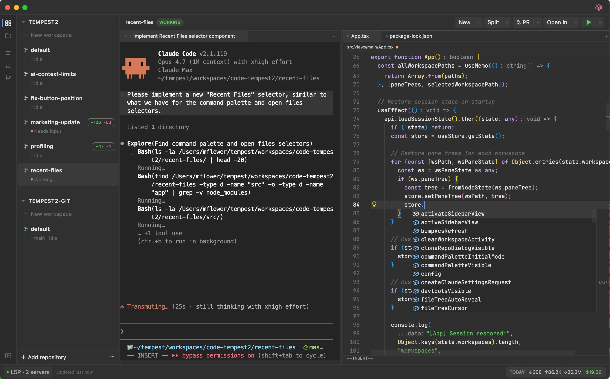
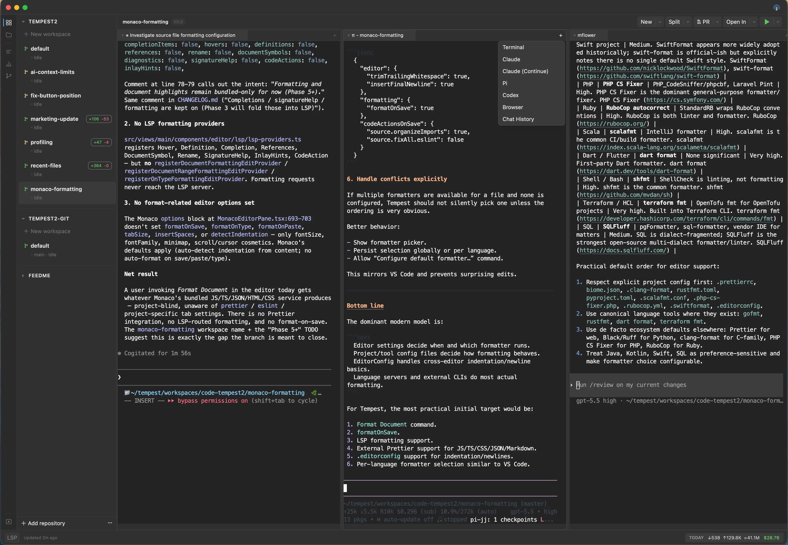
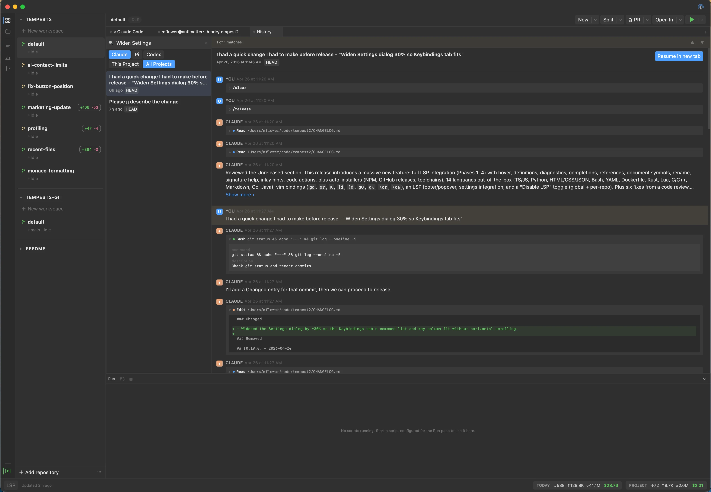
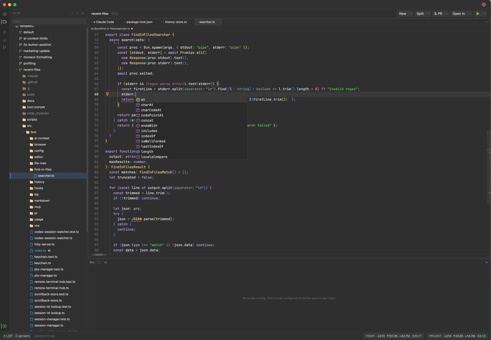
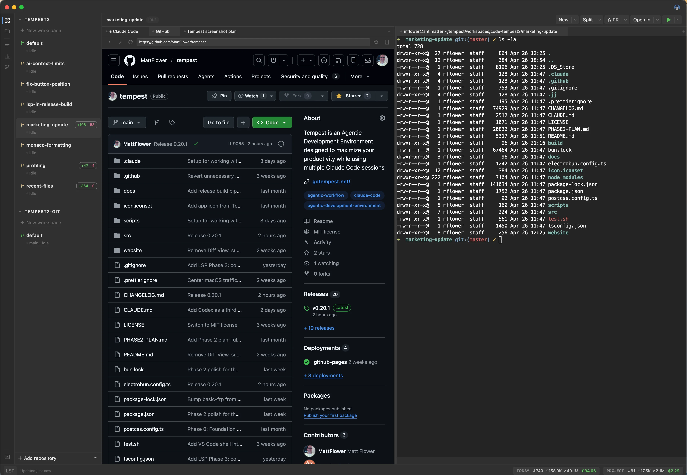
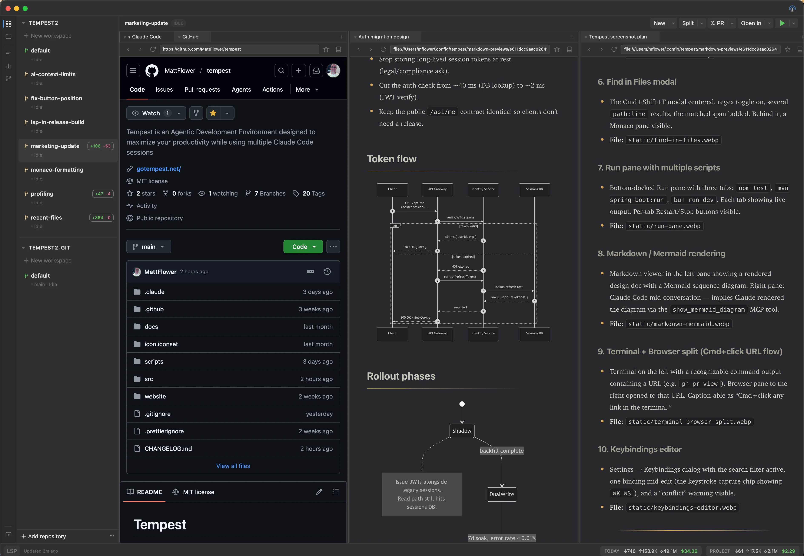
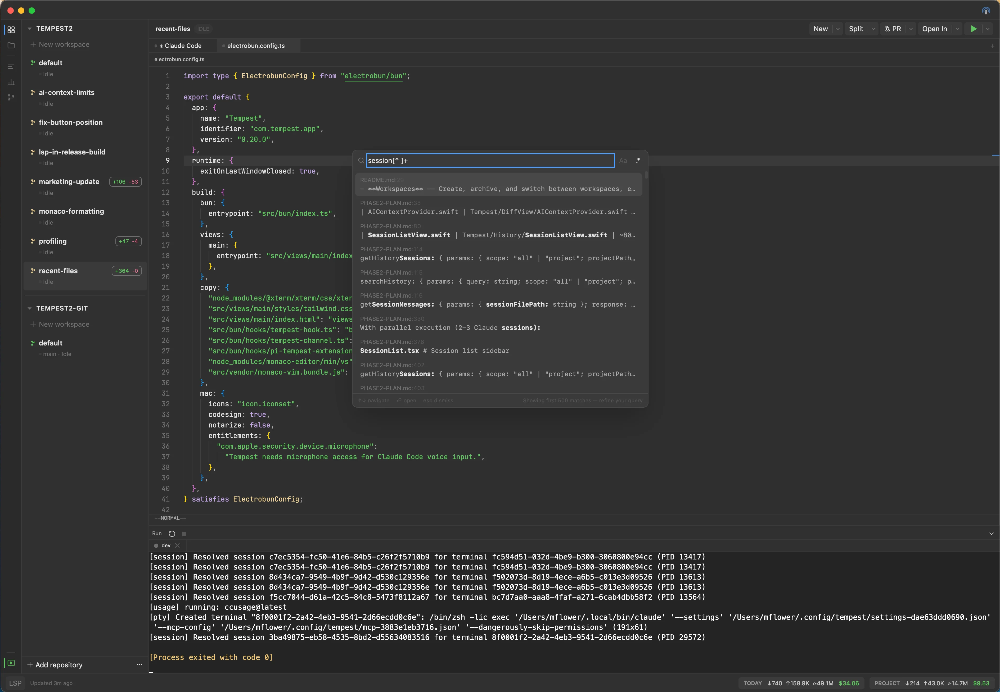
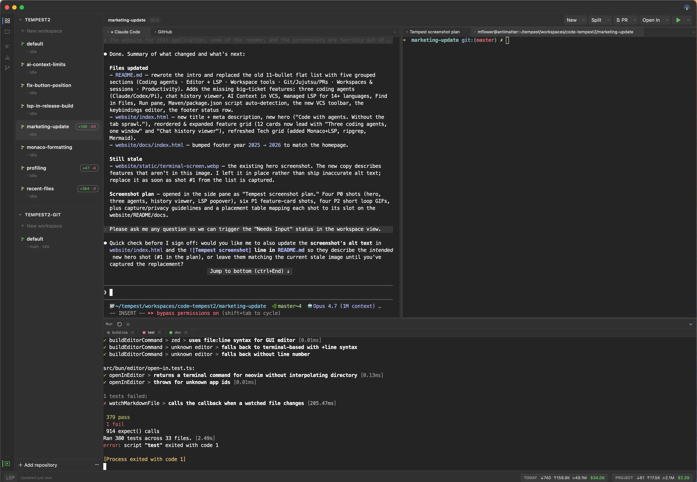
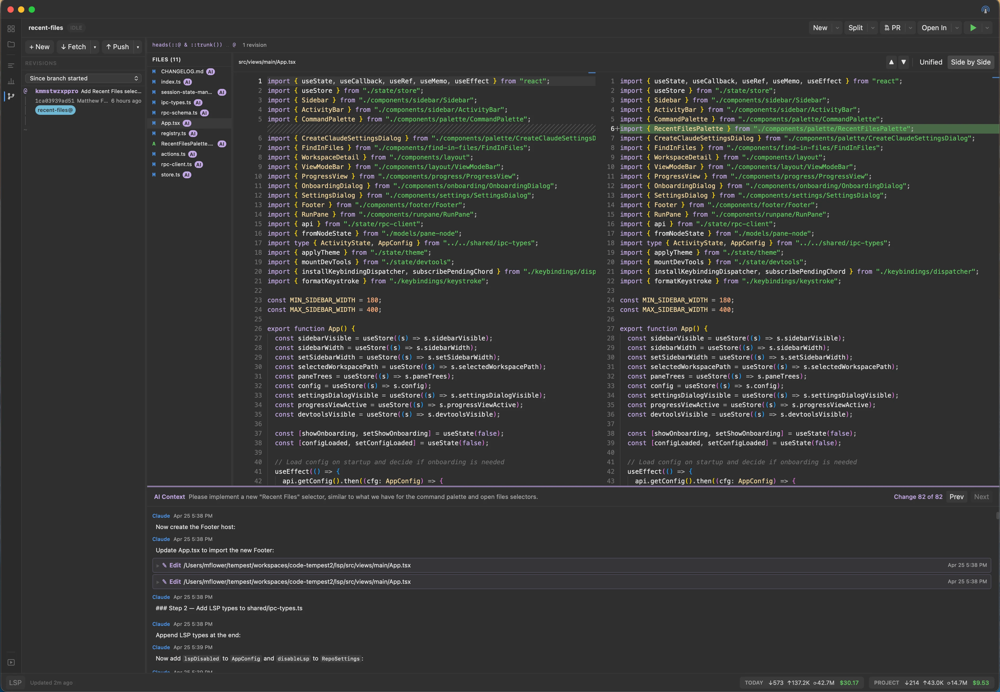
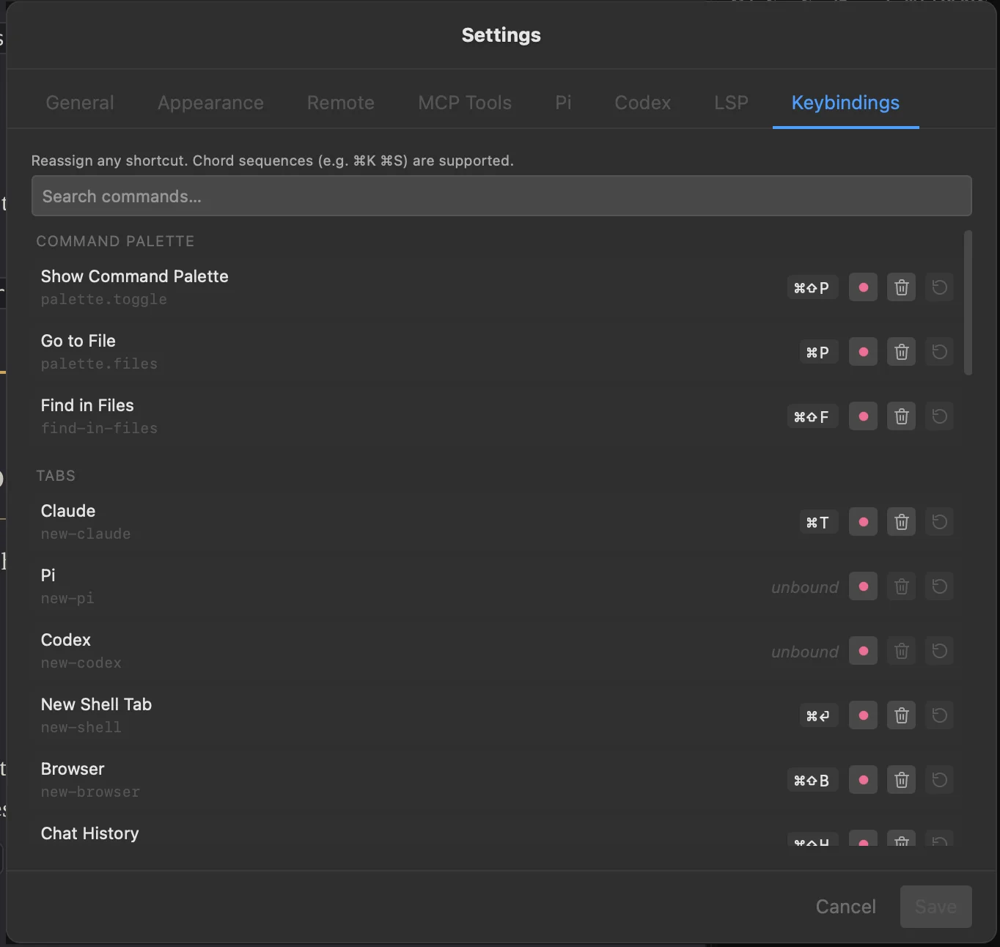

# Tempest



A native macOS workspace for developers working alongside AI coding agents. Tempest puts your terminal, editor, browser, language servers, and Git/Jujutsu tools in a single window -- and treats Claude, Codex, and Pi as first-class tabs with session resume, activity indicators, history search, and inline diff context. Built with [Electrobun](https://electrobun.dev/) (Bun + native WebView).

## Install

### Homebrew (recommended)

```bash
brew tap MattFlower/recipes
brew install --cask tempest
```

### Manual download

Grab the latest `Tempest.dmg` or `Tempest.zip` from the [GitHub Releases](https://github.com/MattFlower/tempest/releases) page.

## Features

### Coding agents



- **Three agents, one window** -- Claude Code, OpenAI Codex, and Pi all run as native tabs. Launch from the `+` menu, command palette, or split toolbar.
- **Auto-resume** -- Tempest reattaches each agent to its prior session on restart (PID/hook for Claude, session-id watcher for Codex, hook socket for Pi).
- **Activity indicators** -- Per-workspace dots show whether an agent is *Working*, *Needs Input*, or *Idle* so you know when to come back.
- **Chat history viewer** -- List, full-text search (ripgrep), and view past sessions across Claude / Codex / Pi. "Resume in new tab" relaunches any session in place.



- **AI Context in VCS** -- Diff panel shows which agent edited each file and why, fanned out across all three providers.
- **Plan mode + permission prompts** for Claude; per-session MCP injection (`show_webpage`, `show_mermaid_diagram`, `show_markdown`) lets agents render visuals into a side pane.

### Editor with managed LSP



- **Monaco + Vim bindings** with workspace-relative path headers and persistent state.
- **Auto-installed language servers for 14+ languages** -- TypeScript/JavaScript, Python, HTML/CSS/JSON, Bash, YAML, Dockerfile, Rust, Lua, C/C++, Markdown, Go, and Java. Tempest installs them on first open into `~/.config/tempest/lsp/` and shows install progress in the footer.
- **Full LSP feature set** -- hover, go-to-definition, find references, diagnostics, rename, completions, signature help, inlay hints, code actions, and document symbols. Vim bindings (`gd`, `gr`, `K`, `gO`, `gK`, `]d`/`[d`, `<leader>cr`, `<leader>ca`) ship out of the box.
- **Per-repo LSP toggle** in repository settings; global toggle in Settings → LSP.

### Workspace tools



- **Terminal** -- xterm.js with WebGL rendering, backed by Bun.Terminal PTY. Cmd+click URLs to open them in a side Browser pane.
- **Browser** -- Tabbed system WKWebView with bookmarks, zoom shortcuts, and split-with-terminal layouts.
- **Markdown viewer** -- Live-rendered with Mermaid diagram support and Cmd+F find-in-page.



- **Find in Files** -- `Cmd+Shift+F` opens a ripgrep-backed modal with regex/case toggles. Enter jumps to the match.



- **Run pane** -- Dockable bottom pane for long-running scripts. Each script runs in its own PTY-backed tab with Restart/Stop controls; stays alive across workspace switches.



- **Custom scripts + auto-detected `package.json` and `pom.xml` scripts** runnable from the green-arrow menu (modal or Run pane).

### Git, Jujutsu, and PRs



- **VCS view** for both Git and Jujutsu -- diffs, status, staging, file scoping, and `Cmd+R` refresh.
- **Pull / Push / Merge / Rebase toolbar** with searchable branch dropdowns and remote pickers.
- **Revert changes** from the Files sidebar context menu.
- **PR monitor** -- track, review, and open pull requests directly in the workspace.

### Workspaces and sessions

- **Workspace-per-task** -- Each workspace has its own terminals, browser tabs, agents, and sessions. Create, archive, and switch with persistent state.
- **Session restore** -- Tempest reopens exactly where you left off, including terminal scrollback (stored per-terminal under `~/.config/tempest/scrollback/`).

### Productivity

- **Command palette** -- `Cmd+Shift+P` for commands, `Cmd+P` for files. Arrow keys target left/right pane.
- **Reassignable keybindings** -- Settings → Keybindings rebinds anything, including chord sequences (`⌘K ⌘S`).



- **Help → Keymap** lists every shortcut with a filter input.
- **Footer status row** for LSP server health (restart/stop, stderr tail) and token usage.
- **Remote control server** -- Optional HTTP server with bearer token auth, web dashboard, and QR code for mobile access.

## Building Locally

### Prerequisites

- macOS
- [Bun](https://bun.sh/) >= 1.3.11

### Setup

```sh
# Install dependencies
bun install

# Start in development mode
bun run dev
```

### Common Commands

| Command | Description |
|---|---|
| `bun run dev` | Build CSS and start the app in dev mode |
| `bun run build:release` | Build a release (stable) bundle |
| `bun run build:css` | Rebuild Tailwind CSS only |
| `bun test` | Run tests |

## Architecture

Two-process model:

- **Bun process** (`src/bun/`) -- Backend: PTY management, session state, file I/O, git operations, RPC handlers
- **React webview** (`src/views/main/`) -- Frontend: UI components, state management (Zustand), terminal/browser/editor rendering

The processes communicate over Electrobun's typed RPC bridge.

## Tech Stack

- Electrobun 1.16.0
- React 19
- Tailwind CSS 4
- Zustand
- xterm.js 6
- Monaco Editor
