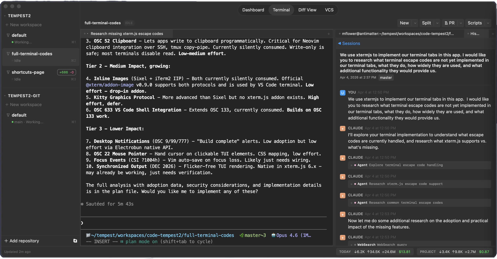

# Tempest



A macOS developer tool built with [Electrobun](https://electrobun.dev/) (Bun + native WebView). Tempest provides an integrated workspace with terminal emulation, a built-in browser, code editing, markdown preview, git/PR workflows, and session management -- all in a single native app.

## Features

- **Terminal** -- xterm.js with WebGL rendering, backed by Bun.Terminal PTY
- **Browser** -- Tabbed browsing via system WKWebView with bookmarks
- **Editor** -- Monaco editor with Vim bindings
- **Markdown viewer** -- Live-rendered markdown with Mermaid diagram support
- **Git & Jujutsu integration** -- Diff viewer, VCS status, file staging for both Git and Jujutsu
- **PR monitor** -- Track and review pull requests
- **Session management** -- Workspace persistence, session state restore, and terminal scrollback capture
- **Workspaces** -- Create, archive, and switch between workspaces, each with their own terminals, browser tabs, and sessions. Activity indicators show whether each workspace is idle, working, or waiting for input.
- **Ask Claude** -- Highlight text in Diff View or VCS View and send it to Claude Code with context automatically included
- **Custom scripts** -- Define parameterized scripts and run them with a button click
- **Command palette** -- Quick access to commands (Cmd+Shift+P) and files (Cmd+P), with arrow keys to target left or right pane
- **Remote control server** -- Optional HTTP server for controlling Tempest remotely, with bearer token auth, a web dashboard, and QR code for easy mobile access

## Prerequisites

- macOS
- [Bun](https://bun.sh/) >= 1.3.11

## Setup

```sh
# Install dependencies
bun install

# Start in development mode
bun run dev
```

## Common Commands

| Command | Description |
|---|---|
| `bun run dev` | Build CSS and start the app in dev mode |
| `bun run build:release` | Build a release (stable) bundle |
| `bun run build:css` | Rebuild Tailwind CSS only |
| `bun test` | Run tests |

## Architecture

Two-process model:

- **Bun process** (`src/bun/`) -- Backend: PTY management, session state, file I/O, git operations, RPC handlers
- **React webview** (`src/views/main/`) -- Frontend: UI components, state management (Zustand), terminal/browser/editor rendering

The processes communicate over Electrobun's typed RPC bridge.

## Tech Stack

- Electrobun 1.16.0
- React 19
- Tailwind CSS 4
- Zustand
- xterm.js 6
- Monaco Editor
